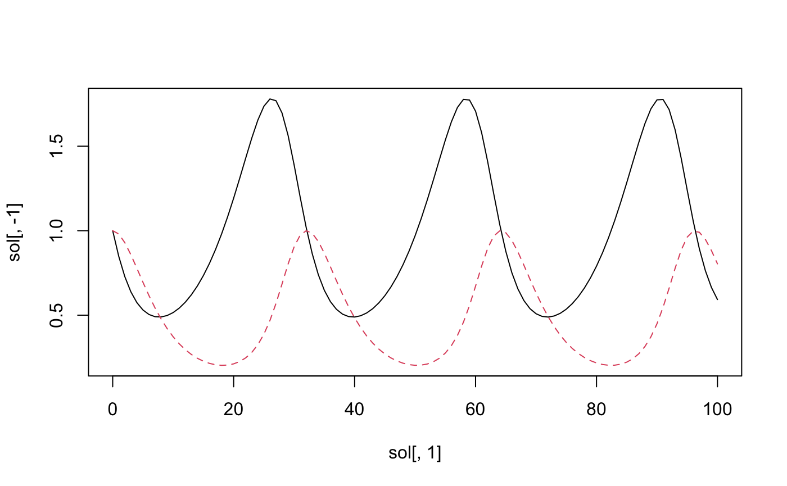

```{r, include = FALSE}
knitr::opts_chunk$set(
  collapse = TRUE,
  comment = "#>"
)
```

```{r setup}
library(elixir)
```

`elixir` is a set of tools for transforming R expressions, including into other
programming languages.

One of the neat features of R is that you can use the language to inspect
itself. Expressions, functions, indeed entire R scripts can be examined and
manipulated just like any list, data.frame, or other R object.

However, the syntax for manipulating R language objects is a little tricky.
Packages such as `rlang` help to make this task easier. `elixir` makes a few
extra shortcuts available, and is geared for advanced R users.

# Find and replace for language objects

Sometimes you want to detect certain patterns within an expression or list of
expressions, or easily replace a certain pattern with another. When working with
strings, regular expressions are a handy way of accomplishing such tasks.
`elixir` provides a sort of "regular expressions for R expressions"
functionality through the functions `expr_match()`, `expr_replace()`, and the
"shortcut" functions `expr_count()`, `expr_detect()`, `expr_extract()`, and
`expr_locate()`.

Frequent users of the [`stringr`](https://stringr.tidyverse.org/) package will 
recognize the intentional similarity between the above functions and 
`str_match()`, `str_replace()`, `str_count()`, `str_detect()`, `str_extract()`, 
and `str_locate()` from `stringr`.

The easiest way to demonstrate these is through an example.

## Example: a domain-specific language for ordinary differential equations

The Lotka-Volterra equations can be used to model a predator-prey interaction as
a system of ordinary differential equations:

$$
dx/dt = \alpha x - \beta x y \\
dy/dt = -\gamma y + \delta x y
$$

Here, $x$ is the predator density, $y$ is the prey density, $\alpha$ is the prey
birth rate, $\beta$ is the rate at which the prey is killed by the predator,
$\gamma$ is the predator net death rate in the absence of prey to eat, and
$\delta$ is the effect of eating prey on the predator birth rate.

One could implement this in R using the package `deSolve`:

```{r, eval = TRUE}
y <- c(x = 1, y = 1)
times <- 0:100
parms <- c(alpha = 1/6, beta = 1/3, gamma = 0.25, delta = 0.25) 

func <- function(t, y, parms)
{
    with(as.list(c(y, parms)), { 
        dx <- alpha * x - beta * x * y 
        dy <- -gamma * y + delta * x * y 
        return (list(c(dx, dy)))
    })
}

# Run this with:
# sol <- deSolve::ode(y, times, func, parms) 
# matplot(sol[, 1], sol[, -1], type = "l")
```

\

If you run those last two lines that are commented out, you should see the
solution plotted as above. (The lines are commented out so that `deSolve` isn't
required to build this vignette.)

Let's suppose that instead we want to start with a set of quoted statements like
this:

```{r}
system <- quote({
    t_end = 100

    x(0) = 1
    y(0) = 1

    dx/dt = alpha * x - beta * x * y
    dy/dt = -gamma * y + delta * x * y

    alpha = 1/6
    beta = 1/3
    gamma = 0.25
    delta = 0.25
})
```

and turn this into the components above. Here is one approach with `elixir`. The
aim isn't to make something totally robust, but just to get something up and
running, and demonstrate the use of the package.

First, we want to set the variable `times` to a set of integers running from 0
to the specified `t_end` within `system`. We can look for a statement of the
form `t_end = .X` like so:

```{r}
expr_match(system, { t_end = .X })
```

`elixir` allows you to quote expressions inline using `{ curly braces }` as
above. It's sort of the equivalent of `"quotation marks"` for a string. This is
handy to avoid having the equals sign `=` interpreted as naming a parameter to
`quote` or `rlang::expr`:

```{r, eval = FALSE}
# neither of these will work
expr_match(system, quote(t_end = .X))
expr_match(system, rlang::expr(t_end = .X))

# instead you would have to do something like this:
expr_match(system, quote((t_end = .X))[[2]])
expr_match(system, rlang::expr((t_end = .X))[[2]])

# This works because the expression (t_end = .X) is a call, which is list-like
# with two elements: 
# [[1]] is the symbol `(`, and [[2]] is the call t_end = .X.
```

We can extract the number `100` from this list returned by `expr_match`, but
instead we will use a shortcut, `expr_extract`:

```{r}
expr_extract(system, { t_end = .X }, "X")
```

This always returns a `list` with as many entries as there are matches, so if
there were two statements of the form `t_end = .X` then this would be a
two-element `list`. We can tell `elixir` to stop after the first match:

```{r}
expr_extract(system, { t_end = .X }, "X", n = 1)
```

or use `expr_count` to make sure there is exactly one `t_end = .X` statement:

```{r}
if (expr_count(system, { t_end = .X }) != 1) {
    stop("Need exactly one specification of end time.")
}
```

and set `times` like so:

```{r}
times <- 0:expr_extract(system, { t_end = .X }, "X")[[1]]
times
```

OK, that's done. Now let's extract the initial state vector. For this we want to
look for patterns of the form `.X(0) = .V`:

```{r}
expr_match(system, { .X(0) = .V })
```

Again, we'll use `expr_extract` to pull out the two needed components, the names
of the states (here "x" and "y") and their initial values (both 1).

```{r}
expr_extract(system, { .X(0) = .V }, "X")
expr_extract(system, { .X(0) = .V }, "V")

y <- as.numeric(expr_extract(system, { .X(0) = .V }, "V"))
names(y) <- as.character(expr_extract(system, { .X(0) = .V }, "X"))
y
```

Now for parameters, we might initially think to use:

```{r}
expr_match(system, { .P = .X })
```

But that picks up `t_end` and misses out on `alpha` and `beta`. The reason the
latter two components are missed out is that in `.P = .X`, `.X` only matches a
single token, and `1/6` is an expression with three tokens, `/`, `1`, and `6`.
So we'll use `..X` instead of `.X` so that we can match any subexpression:

```{r}
expr_match(system, { .P = ..X })
```

We can also filter out t_end by adding a "test" to the capture token `.P` like
so:

```{r}
expr_match(system, { `.P|P != "t_end"` = ..X })
```

Anything after the `|` is interpreted as a condition to evaluate, and the match
only succeeds if the condition evaluates to `TRUE`. Within the condition, `.` is
a placeholder for the matched token, but we can also use the name of the token
itself, i.e. `P`. Note that we have to wrap the whole capture token in backticks
so that it gets read as a single symbol.

All together, we can get the parameters like so:

```{r}
parms <- expr_extract(system, { `.P|P != "t_end"` = ..X }, "X")
parms <- sapply(parms, eval)
names(parms) <- as.character(expr_extract(system, { `.P|P != "t_end"` = ..X }, "P"))
```

We need to use `eval` on what has been captured by `..X` in order to evaluate
the quoted expressions.

Capturing the ordinary differential equations themselves, and inserting this
into a function that `deSolve` can use, requires us to look for patterns
`dX/dt = ...`; since the "dX" there is one symbol, we will check it to make sure
it is a symbol that starts with a lowercase d:

```{r}
expr_match(system, { `.A:name|substr(A, 1, 1) == "d"`/dt = ..X })
```

Here, the `:name` checks that the the captured element `.A` is of class `name`.

Let's extract the statements:

```{r}
statements <- expr_extract(system, { `.A:name|substr(A, 1, 1) == "d"`/dt = ..X })
statements
```

We can now use `expr_replace` to change e.g. `dX/dt = ...` to `dX <- ...` so
that it is a valid R assignment statement:

```{r}
R_statements <- expr_replace(statements,
    { `.A:name|substr(A, 1, 1) == "d"`/dt = ..X },
    { .A <- ..X })
R_statements
```

Let's also extract the names of the derivatives themselves, i.e. `dx` and `dy`:

```{r}
derivatives <- expr_replace(R_statements, { .D <- ..X }, { .D })
derivatives
```

Finally we put this all into a function using `rlang` and its injection
operators:

```{r}
func <- eval(rlang::expr(
    function(t, y, parms)
    {
        with(as.list(c(y, parms)), {
            !!!R_statements
            return (list(c(!!!derivatives)))
        })
    }
))
```

Putting it all together into a wrapper function, we get something like this:

```{r}
run_ode <- function(system)
{
    # Get times
    if (expr_count(system, { t_end = .X }) != 1) {
        stop("Need exactly one specification of end time.")
    }
    times <- 0:expr_extract(system, { t_end = .X }, "X")[[1]]
    
    # Get initial state
    y <- as.numeric(expr_extract(system, { .X(0) = .V }, "V"))
    names(y) <- as.character(expr_extract(system, { .X(0) = .V }, "X"))
    
    # Get parameters
    parms <- expr_extract(system, { `.P|P != "t_end"` = ..X }, "X")
    parms <- sapply(parms, eval)
    names(parms) <- as.character(expr_extract(system, { `.P|P != "t_end"` = ..X }, "P"))
    
    # Get statements
    statements <- expr_extract(system, { `.A:name|substr(A, 1, 1) == "d"`/dt = ..X })
    R_statements <- expr_replace(statements,
        { `.A:name|substr(A, 1, 1) == "d"`/dt = ..X },
        { .A <- ..X })
    derivatives <- expr_replace(R_statements, { .D <- ..X }, { .D })
    
    func <- eval(rlang::expr(
        function(t, y, parms)
        {
            with(as.list(c(y, parms)), {
                !!!R_statements
                return (list(c(!!!derivatives)))
            })
        }
    ))
    
    # uncomment if deSolve is available:
    # sol <- deSolve::ode(y, times, func, parms) 
    # matplot(sol[, 1], sol[, -1], type = "l")
}

system <- quote({
    t_end = 100

    x(0) = 1
    y(0) = 1

    dx/dt = alpha * x - beta * x * y
    dy/dt = -gamma * y + delta * x * y

    alpha = 1/6
    beta = 1/3
    gamma = 0.25
    delta = 0.25
})

run_ode(system)
```

\

# Other `elixir` features

The function `expr_apply()` allows you to transform and extract information from
nested list structures which contain expressions, so if you have a big structure
and you want to check all the variable names or make certain replacements, this
may be useful.

`expr_sub()` offers an interface for extracting or replacing part of an
expression; the one advantage this has over `[[` is that it allows you to use
`NULL` as the index, which gives back the whole expression.

`lang2str()` does the opposite of `str2lang()`; it is like `deparse1()` which is
new since R 4.0.0, but with `collapse = ""` instead of `collapse = " "`.

Finally, `meld()`, `translate()`, and `reindent()` are various experimental
functions for constructing code using R.
